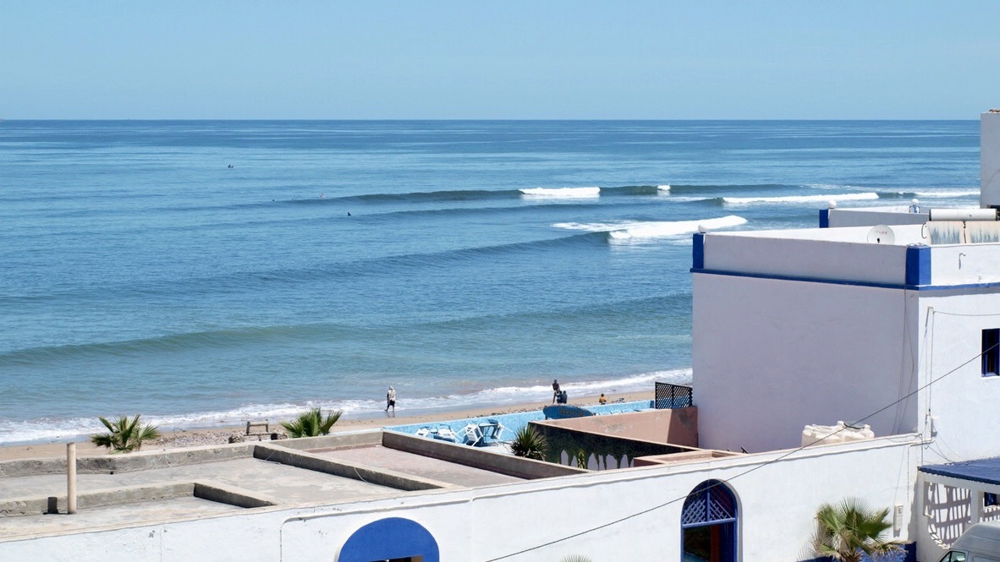

# Ettore's User Page 

*Engineering Student at **IMT Atlantique**, France, currently in exhange abroad at **UCSD**, USA.*

I'm 23 years old, coming from Guidel in Britany, France. I'm an engineering student at IMT Atlantique, Brest, France. Currently doing a semester exchange abroad in UC San Diego, CA, United States.

I'm looking for an end-of-studies internship but it could also be an international volunteering in business. I'd to do data science and computer science in a company where I could learn a lot about a new field or business. 

> It's me.

## Skills

- **Tools and Languages**: Python, Git, AWS, MarkDown, R, MySQL, \LaTeX
- **Quantitative Research**: Mathematical optimization, Mathematical Modeling, Machine Learning & Deep Learning 
- **Communication**: French, English (fluent speaker), Spanish (reading and writing)

## Education

1. High School at Lycée St Louis, Lorient, France. (2017) // Scientific Option 
2. Preparatory Class at Lycée St Stanislas, Nantes, France. (2017-2019) // Mathematics and Physics Scpecialities 
3. Engineering School at IMT Atlantique, Brest, France. (2019 - Now) // Mathematical and Computational Engineering 

## Technical Experience

- [x] 6 months internship at Reezocar, Paris as Data Scientist
- [x] 3 months fixed term contract at Reezocar as Data Scientist
- [ ] 6 months end-of-studies internship or 12 months of international volunteering in a company

## Activities

I surf a lot, since i've 8 years old. I did competitions (National level).

I did collective Sport during engineering school as rugby and volleyball.

This year I travel multiple times:
- A roadtrip to Morocco (March-June 2022) with two friends, and i discover an interest for photography.

- Two weeks in Montreal, Canada.
- Now in San Diego.

This site was built using [GitHub Pages](https://pages.github.com/). 
[Access the Readme file for this project](README.md) 
Use `git clone https://github.com/ettoreh/cse110-2022-fa` to clone the repository of this project.